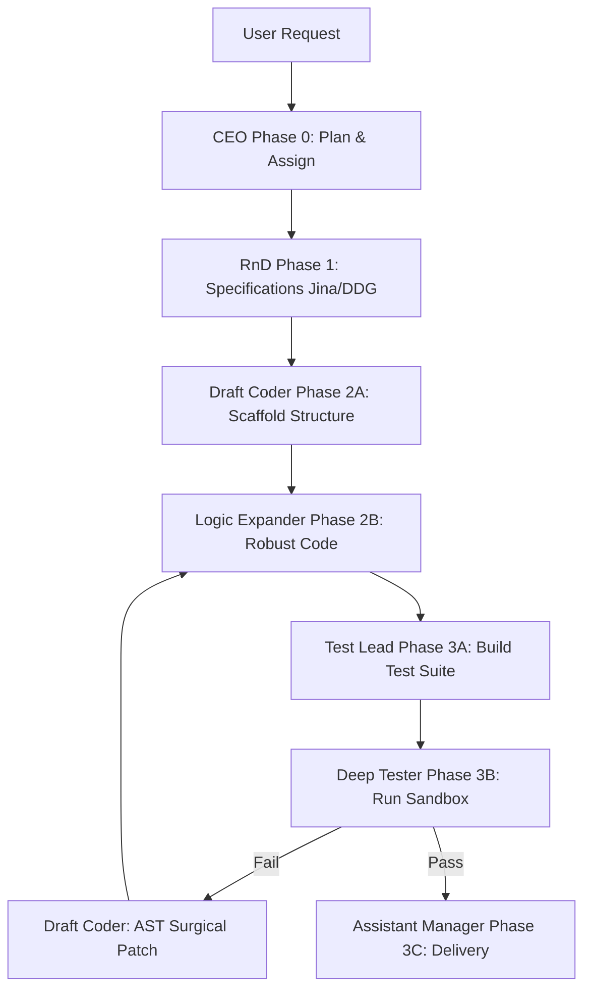

# Antigravity Multi-Agent Agency Framework

An autonomous software development system designed to orchestrate a team of LLM agents (incorporating Google Gemini and local Ollama models) to design, build, test, and surgically patch software applications under strict budget constraints and isolated sandbox gates.

---

## 🏗️ System Architecture & Workflow

The framework operates sequentially through standardized phases, utilizing a hybrid routing strategy to run sandboxed CLI tools or cloud API calls:



---

## 📂 Core Component Registry

- **[manager.py](file:///e:/Mult_agent/manager.py)**: CLI entry point for new, existing, and team triage pipelines.
- **[api_bridge.py](file:///e:/Mult_agent/api_bridge.py)**: The communication link interfacing the GenAI SDK, local Ollama API, and search search engines (DuckDuckGo, Jina Reader).
- **[config.py](file:///e:/Mult_agent/config.py)**: Roster configurations, model parameters, token budgets, and cost mapping.
- **[agency/orchestration.py](file:///e:/Mult_agent/agency/orchestration.py)**: Phase pipeline mechanics from briefing to delivery.
- **[agency/triage.py](file:///e:/Mult_agent/agency/triage.py)**: Classification router classifying issues into `code_issue`, `design_issue`, or `both`.
- **[agency/testing.py](file:///e:/Mult_agent/agency/testing.py)**: Isolated execution sandbox handling automatic package resolutions and process timeouts.
- **[agency/patching.py](file:///e:/Mult_agent/agency/patching.py)**: AST (Abstract Syntax Tree) parsing engine for surgically extracting and patching individual functions.
- **[agency/memory.py](file:///e:/Mult_agent/agency/memory.py)**: Persistence layer saving historical logs both globally and locally per project.
- **[agency/governance.py](file:///e:/Mult_agent/agency/governance.py)**: Token tracker cost enforcement and human approval checkpoints.

---

## 🛠️ Recent Improvements & Resilience Fixes

During extreme destructive testing, the framework was hardened with the following updates:
- **Null Safety**: Resolved `TypeError` in `TokenTracker` cost calculations when receiving empty responses.
- **State Recovery**: Protected `get_unread_delta()` from JSON decode crashes when read-state configurations are empty or corrupt.
- **Robust Searching**: Wired fallback to DuckDuckGo when Jina API keys are exhausted or return 500 errors.
- **Infinite Loop Defense**: Hardened execution sandboxes with a 15-second default timeout to prevent long hangs on infinite loops.
- **Non-Greedy Parsing**: Replaced greedy regex matchers with non-greedy variants to parse multiple JSON segments cleanly.
- **Indentation Fallback**: Added a regex-based indentation parser to extract functions when AST parsing fails due to Python syntax errors.
- **Smart Test Mapping**: Resolved E2E test failures signatures directly to production flask routes (e.g. `home_page` -> `index`).

---

## 🚀 Running the Framework

### 1. Requirements
Ensure Python 3.10+ and the required packages are installed:
```bash
pip install google-genai requests duckduckgo-search pydantic pytest playwright
playwright install chromium
```

### 2. Startup
Run the interactive CLI selector:
```powershell
python manager.py
```

### 3. Running Framework Tests
To run the automated extreme destructive test suite:
```powershell
python -m pytest extreme_destructive_tests.py
```
